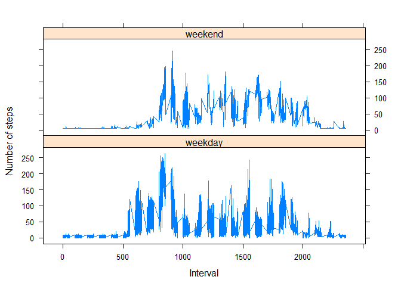

# Reproducible Research: Peer Assessment 1


## Loading and preprocessing the data

```r
rm(list=ls())
source("helper/fileReader.R")
unZipFile()
```

```
## uziping data to folder...  data
```

```r
activityRawData <- read.csv("data/activity.csv")

activityRawData$date <- as.POSIXct(activityRawData$date, format="%Y-%m-%d")
activityRawData$weekday <- tolower(weekdays(activityRawData$date))

activityRawData$isweekend <- ifelse(activityRawData$weekday == "saturday" | activityRawData$weekday == "sunday", "weekend", "weekday")
```

## What is mean total number of steps taken per day?

```r
sumStepsPerDay <- aggregate(activityRawData$steps, by=list(activityRawData$date), FUN=sum, na.rm=TRUE)
head(sumStepsPerDay)
```

```
##      Group.1     x
## 1 2012-10-01     0
## 2 2012-10-02   126
## 3 2012-10-03 11352
## 4 2012-10-04 12116
## 5 2012-10-05 13294
## 6 2012-10-06 15420
```

```r
cnames <- c("date","steps")
names(sumStepsPerDay) <- cnames
hist(sumStepsPerDay$steps,breaks=seq(from=0, to=25000, by=2000),main="Histogram of the total number of steps taken each day",xlab="Total number of steps")
```

\

```r
mean(sumStepsPerDay$steps)
```

```
## [1] 9354.23
```

```r
median(sumStepsPerDay$steps)
```

```
## [1] 10395
```

##What is the average daily activity pattern?

```r
rm(sumStepsPerDay)

# Compute the means of steps accross all days for each interval
meanData <- aggregate(activityRawData$steps, 
                       by=list(activityRawData$interval), 
                       FUN=mean, 
                       na.rm=TRUE)

# Rename the attributes
names(meanData) <- c("interval", "mean")
head(meanData)
```

```
##   interval      mean
## 1        0 1.7169811
## 2        5 0.3396226
## 3       10 0.1320755
## 4       15 0.1509434
## 5       20 0.0754717
## 6       25 2.0943396
```

```r
plot(meanData$interval, 
     meanData$mean, 
     type="l",      
     xlab="Interval [minutes]", 
     ylab="Average number of steps", 
     main="Time-series of the average number of steps per intervals")
```

\

```r
#interval for maximum mean
maxInterval <- meanData[which(meanData$mean == max(meanData$mean)), 1]
```

##Inputing the missing values

```r
NACount <- sum(is.na(activityRawData$steps))
NAIndices <- which(is.na(activityRawData$steps))

meanVec <- rep(mean(activityRawData$steps, na.rm=TRUE), times=length(NAIndices))
copyData <- activityRawData
copyData[NAIndices, "steps"] <- meanVec


sumData <- aggregate(copyData$steps, by=list(copyData$date), FUN=sum)


names(sumData) <- c("date", "total")

# Compute the histogram of the total number of steps each day
hist(sumData$total, 
     breaks=seq(from=0, to=25000, by=2500),
     col="blue", 
     xlab="Total number of steps",      
     main="Histogram of the total number of steps taken each day\n(NA replaced by mean value)")
```

\

```r
mean(sumData$total)
```

```
## [1] 10766.19
```

```r
median(sumData$total)
```

```
## [1] 10766.19
```

## Are there differences in activity patterns between weekdays and weekends?

# Compute the average number of steps taken, averaged across all daytype variable

```r
meanData <- aggregate(copyData$steps, by=list(copyData$isweekend, copyData$weekday, copyData$interval), mean)
names(meanData) <- c("isweekend", "weekday", "interval", "mean")
	 
require("lattice")
```

```
## Loading required package: lattice
```

```
## Warning: package 'lattice' was built under R version 3.2.3
```

```r
xyplot(mean ~ interval | isweekend, meanData, type="l", 
       lwd=1, xlab="Interval", ylab="Number of steps", 
       layout=c(1,2))	 
```

\
	 
	 


